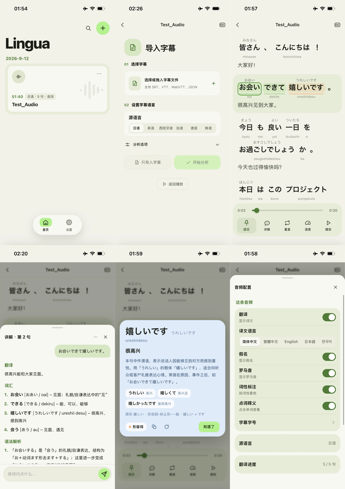

# Lingua

Lingua 是一个面向语言学习的播放器。它把音视频、字幕、逐词时间轴、注音、转写、词性、译文和词汇讲解放在同一条学习流程。支持 Android、iOS 和 Web 平台。支持日语、英语、西班牙语、法语、德语和韩语。

## 功能概览

- 支持导入音视频：WAV、MP3、M4A、FLAC、OGG、OPUS，以及 MP4、WebM、MOV 等。
- 支持词级 JSON、带内联时间戳的 WebVTT、普通 SRT / VTT。
- 支持展示日语假名与罗马音、韩语发音与罗马字、英语/西班牙语/法语/德语音标与原形。
- 支持句子成分分解、词性着色、逐词高亮、音标显示、原形显示。
- 支持接入大模型自动生成翻译，以及按需生成单词和句子讲解。
- 支持画中画播放、字幕悬浮窗、变速播放、单句重复、字幕自动跟随。
- 本地保存音视频、分析结果与大模型产物，支持用户数据导出、导入。
- 内置工作台支持本地音频提取、压制，以及在线转录、快捷导入。

## 界面预览



## 安装

项目分为前端和分析后端。前端可独立运行，但句子成分分解、词性分析、注音和词形还原等功能需要分析后端提供的 API。

### Android / iOS （纯前端）
在 [Releases](https://github.com/RzMY/Lingua/releases) 下载对应安装包。

### Docker 部署 （包括Web前端和分析后端）

首次部署先复制配置文件：

```bash
cp .env.docker.example .env.docker
```
编辑 `.env.docker`，设置 `LINGUA_API_TOKEN`。

#### 拉取远程镜像

拉取已发布的镜像并启动：

```bash
docker compose --env-file .env.docker pull
docker compose --env-file .env.docker up -d --no-build --wait
```

#### 本地构建

在 `.env.docker` 中设置 `LINGUA_IMAGE=lingua:local`，然后构建并启动：

```bash
docker compose --env-file .env.docker build
docker compose --env-file .env.docker up -d --no-build --wait
```

#### 原生访问

- Android：在浏览器中打开页面，添加书签到主屏幕。
- IOS：在 [WebClip](https://webclip-vue-app.vercel.app) 添加 WebClip。

## 开始使用

- 在首页导入音频或视频，选择源语言，即可进行播放。
- 在播放页导入字幕，即可直接显示原文并按句定位播放。
- 句子成分分解、注音、原形和词性等分析功能，需要在「设置 → 分析后端」配置分析后端地址和访问令牌。
- 翻译、单词和句子讲解等大模型功能，需要在「设置 → 大模型」填写接口地址、模型名和所需的 API Key。

## 设置说明

设置按作用范围分为三类：

- **连接与模型**：分析后端地址、访问令牌、大模型地址、API Key、模型名、提示词和调用参数。
- **学习偏好**：目标学习语言、各源语言的默认显示层、字幕元素的大小显示、软件的主题色。
- **数据管理**：导入/导出数据、补充缺失文件、查看存储明细和清理模型产物。
- **更新管理**：检查更新、下载更新、安装更新。

## 工作台（实验性功能）

在「设置 → 系统」开启「实验性功能」后，底部导航的首页与设置之间显示工作台。

### 提取聆听音频：
- 普通 MP4 的 AAC/ALAC 原音轨直接分离为 M4A。
- 已有无损 WAV 直接复用，其他支持的格式解码为浮点 WAV，保留原采样率与声道。
### 生成ASR音频：
- 下采样聆听音频生成 16 kHz MP3 用于转录。
### 转录：
- 点击「转录接口配置」，设置 OpenAI 兼容接口地址、API Key、模型与结果格式。
- 输入音频可直接引用第一步的聆听原音频，也可引用第二步的 ASR 音频。

## 字幕格式

### 词级 JSON

兼容 Whisper、WhisperX 和 faster-whisper 常见结构。示例：

```json
{
  "language": "ja",
  "segments": [
    {
      "start": 0.0,
      "end": 2.4,
      "text": "今日はいい天気ですね。",
      "words": [
        {"word": "今日", "start": 0.0, "end": 0.6},
        {"word": "は", "start": 0.6, "end": 0.8}
      ]
    }
  ]
}
```

### SRT / 普通 WebVTT

支持句级时间戳并按整句高亮。

### 带内联时间戳的 WebVTT

支持卡拉 OK 风格的 `<00:00:01.400>` 标记，后端会将其转换为词级时间片段。

## 支持的语言

| 代码 | 语言 | 分词引擎 | 上层文字 | 下层文字 |
| --- | --- | --- | --- | --- |
| `ja` | 日语 | MeCab + UniDic | 假名 | 罗马音 |
| `en` | 英语 | spaCy | 音标 | 原形 |
| `es` | 西班牙语 | spaCy | 音标 | 原形 |
| `fr` | 法语 | spaCy | 音标 | 原形 |
| `de` | 德语 | spaCy | 音标 | 原形 |
| `ko` | 韩语 | spaCy | 发音 | 罗马字 |

## HTTP API

### `GET /api/health`

返回版本、`schemaVersion`、支持的字幕格式和语言依赖状态。`?probe=1` 会实际检查语言分析器依赖。

### `POST /api/analyze`

请求体为字幕原文，参数包括：

- `lang`：源语言代码。
- `id`、`title`：音频标识和标题。
- `split`：是否按停顿拆分长句。
- `merge`：是否合并形态素。
- `estimate`：无词级时间戳时是否估算词时间。
- `duration`：音频时长。
- `name`：字幕文件名。

响应结构：

```json
{"ok": true, "log": ["..."], "track": {"schemaVersion": 2, "sentences": []}}
```
## 开源致谢

* **LinuxDo** [LinuxDo 官方网站](https://linux.do/)。
* **lamejs** [LAME 官方网站](http://lame.sourceforge.net)。
* **MeCab** [MeCab 官方网站](https://taku910.github.io/mecab/)。
* **UniDic** [UniDic 官方网站](https://clrd.ninjal.ac.jp/unidic/)。
* **spaCy** [spaCy 官方网站](https://spacy.io/)。
* **Capacitor** [Capacitor 官方网站](https://capacitorjs.com/)。
* **g2p-en** [g2p-en GitHub 仓库](https://github.com/Kyubyong/g2p)。
* **hangulpy** [hangulpy GitHub 仓库](https://github.com/gaon12/hangulpy)。
* **eSpeak NG** [eSpeak NG GitHub 仓库](https://github.com/espeak-ng/espeak-ng)。

## 许可

本项目使用 MIT License，详见 [LICENSE](LICENSE)。
